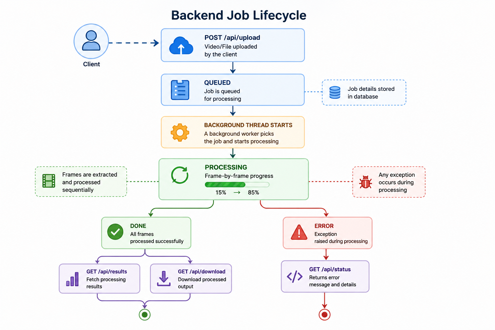
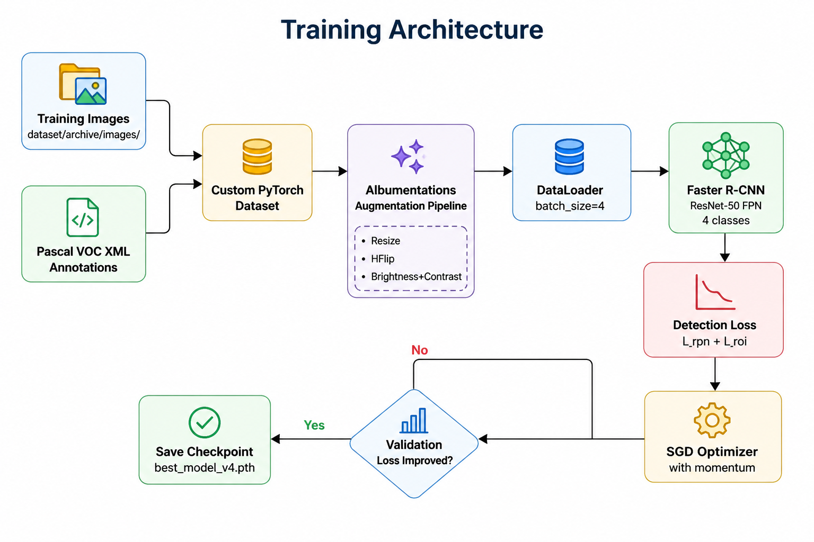

# 🪖 Safesight 
A project under the course UCS532: Computer vision (3W13)

<div align="center">


*An end-to-end computer vision system for detecting helmet compliance in video — without YOLO.*
</div>

## Table of Contents

- [Overview](#overview)
- [Motivation](#motivation)
- [Problem Statement](#problem-statement)
- [Key Idea](#key-idea)
- [System Architecture](#system-architecture)
- [Pipeline Walkthrough](#pipeline-walkthrough)
- [Core Logic: Helmet Reasoning Engine](#core-logic-helmet-reasoning-engine)
- [Mathematics](#mathematics)
- [Training Architecture](#training-architecture)
- [API Reference](#api-reference)
- [Project Structure](#project-structure)
- [Setup & Installation](#setup--installation)
- [Evaluation](#evaluation)
- [Strengths & Limitations](#strengths--limitations)
- [Future Work](#future-work)

## Overview

SafeSight is a *multi-stage computer vision pipeline* that processes uploaded videos to detect helmet-compliance violations. It is built without YOLO — instead using *Faster R-CNN* (ResNet-50 FPN backbone) combined with a custom rule-based spatial reasoning engine that infers whether a person is wearing a helmet.

The system is not just a model. It includes:

- A trained *Faster R-CNN* detector for helmet, head, and person
- A *Helmet Reasoning Engine* using IoU-based spatial logic
- A *Flask REST API* with background job processing
- A *React / Vite* frontend for upload, progress tracking, and results
- Optional *image enhancement* pre-processing for low-quality footage

## Motivation
Industrial environments like warehouses and factories are high-risk zones where strict safety compliance—such as wearing helmets—is essential. However, manual monitoring is often inconsistent, error-prone, and not scalable across large facilities. As a result, safety violations frequently go unnoticed until accidents occur.

SafeSight automates safety monitoring using computer vision to detect helmet compliance in real time. It enables continuous surveillance through existing camera systems, reduces reliance on manual supervision, and improves overall workplace safety efficiently.


## Problem Statement

In safety-critical environments — construction sites, factories, roads — monitoring helmet compliance from CCTV or recorded video manually is:

- *Slow* — hours of footage per inspector
- *Error-prone* — fatigue causes missed violations
- *Not scalable* — grows linearly with camera count

The detection problem itself is hard:

- The same person appears across hundreds of frames
- Helmets can be partially occluded
- Lighting conditions vary drastically
- Heads are often small relative to the full frame
- Raw detections must be converted into meaningful, timestamped violation events

*Goal:* Build an automated system that detects violations, annotates the video, and returns a structured report through an API — fast enough for practical use and explainable enough to debug.


## Key Idea

> Instead of detecting helmets with YOLO, use *Faster R-CNN + Spatial Reasoning*.

The model is trained to detect three objects:

| Class | Meaning |
|---|---|
| helmet | A helmet visible in the frame |
| head | A bare head (no helmet visible) |
| person | A person's full body |

The *Helmet Reasoning Engine* then interprets these detections using two complementary rules, combining them to produce a final violation decision per person per frame.


## System Architecture

### High-Level System Design


### Detailed Processing Flow


### Backend Job Lifecycle





## Pipeline Walkthrough

### Step 1 — Upload & Job Creation

The user uploads a video through the frontend. The Flask backend:

1. Saves the file to uploads/
2. Generates a short job_id (UUID prefix)
3. Initialises an in-memory job record
4. Spawns a *background daemon thread* to process the video
5. Returns job_id immediately so the frontend can poll status

### Step 2 — Frame Sampling

Reading every frame from a long video is expensive. The system uses *frame skipping*:

- Only frames where frame_idx % FRAME_SKIP == 0 are sent to the model
- Skipped frames reuse the previous frame's bounding boxes
- This gives 5× reduction in inference calls with minimal visual impact

### Step 3 — Batch Inference

Sampled frames are buffered until BATCH_SIZE = 8 accumulate, then sent to Faster R-CNN in a single GPU batch. This is significantly faster than one-by-one inference.

### Step 4 — Helmet Reasoning Engine

The raw detections are passed to the *Helmet Reasoning Engine* (see next section).

### Step 5 — Annotation & Video Reconstruction

Each frame is annotated with:

- *Gray* boxes for detected persons
- *Green* boxes for detected helmets
- *Red* boxes with NO HELMET XX% for violations
- A *red alert banner* across the top if any violation is found in that frame

The frames are written in order to an mp4v output file.

### Step 6 — Violation Aggregation

Individual frame violations are grouped by timestamp. Consecutive seconds are merged into ranges (e.g., 00:12 - 00:15), giving a clean, human-readable violation report.


## Core Logic: Helmet Reasoning Engine

The heart of the project is no_helmet_detection.py. It converts raw bounding boxes into safety decisions using two complementary strategies


### Strategy 1 — Direct Head Detection

The model was trained with a head class that specifically represents a bare (unprotected) head. Any head prediction above the confidence threshold is directly flagged as a violation.

- *Advantage:* Fast, no extra computation
- *Limitation:* Depends on model being confident about distinguishing head from helmet

### Strategy 2 — IoU-Based Person-Helmet Cross-Check

For each person box:

1. Extract the *head region* — top 40% of the person bounding box
2. Compute *IoU* between this head region and every detected helmet box
3. Take the *maximum overlap* found
4. If max_overlap < 0.10 → no helmet is covering that person's head

*Why this matters:* A compliant person should have a helmet box that strongly overlaps the top of their body box. If the overlap is absent or negligible, the head is unprotected.

The no-helmet confidence score is directly derived from this:


no_helmet_confidence = 1.0 - max_overlap_iou


If IoU = 0.0 (no helmet anywhere near), confidence = 1.0 (certain violation).
If IoU = 0.9 (helmet fully covers head region), confidence = 0.1 (likely compliant).


## Mathematics

### Intersection over Union (IoU)

For two bounding boxes $A$ and $B$:

$$IoU(A, B) = \frac{|A \cap B|}{|A \cup B|}$$

Where $|A \cap B|$ is the intersection area and $|A \cup B|$ is the union area. Used in two places: detection evaluation and helmet-head overlap checking.

### Head Region Approximation

For a person box $P = (x_1, y_1, x_2, y_2)$ with height $h = y_2 - y_1$:

$$H = (x_1,\ y_1,\ x_2,\ y_1 + \alpha h), \quad \alpha = 0.40$$

The top 40% of the person box is treated as the expected head location.

### No-Helmet Confidence Score

$$O_{max} = \max_j\ IoU(H,\ \text{Helmet}_j)$$

$$C_{\text{no-helmet}} = 1 - O_{max}$$

A violation is flagged when $O_{max} < 0.10$.


### Part 1 — Faster R-CNN Model Architecture

The full inference pipeline is:

```
Input Image → ResNet-50 Backbone → FPN → RPN → ROI Align → Detection Head
```

#### 1.1 ResNet-50 Backbone (Feature Extractor)

ResNet-50 extracts spatial features from the input image using **residual blocks**. The core innovation is the **skip connection**, which learns a residual instead of a full mapping:

$$y = F(x,\ \{W_i\}) + x$$

Instead of learning $H(x)$ directly, the network learns the residual $F(x) = H(x) - x$. This solves the **vanishing gradient** problem in deep networks.

ResNet-50 has 50 layers organised into 4 stages of $[3, 4, 6, 3]$ residual blocks. Each stage produces a feature map at a different spatial scale:

| Stage | Stride | Feature Map (800×800 input) |
|---|---|---|
| C2 | /4 | 200 × 200 |
| C3 | /8 | 100 × 100 |
| C4 | /16 | 50 × 50 |
| C5 | /32 | 25 × 25 |

#### 1.2 Feature Pyramid Network (FPN)

Helmets vary greatly in size relative to the frame. FPN solves the **multi-scale detection** problem by merging features top-down across all backbone stages:

$$P_n = \text{Conv}_{1\times1}(C_n) + \text{Upsample}(P_{n+1})$$

This gives **semantically strong** (from deep layers) and **spatially precise** (from shallow layers) features at every scale simultaneously. The result is four pyramid levels P2–P5 that the RPN and detection head both operate on.

#### 1.3 Region Proposal Network (RPN)

The RPN slides over every location in each FPN feature map and asks: *"Is there an object here, and where exactly?"*

At each spatial location, **k anchor boxes** are generated (k = 9: 3 scales × 3 aspect ratios). For a 50×50 feature map: $50 \times 50 \times 9 = 22{,}500$ anchors.

For each anchor the RPN outputs two things:

**A) Objectness Score**

$$p^* = \sigma(W_o \cdot f) \in [0, 1]$$

**B) Bounding Box Regression Deltas**

$$t_x = (x - x_a) / w_a \qquad t_y = (y - y_a) / h_a$$
$$t_w = \log(w / w_a) \qquad t_h = \log(h / h_a)$$

Where $(x_a, y_a, w_a, h_a)$ are anchor coordinates and $(x, y, w, h)$ is the predicted box.

**RPN Loss (multi-task):**

```text
L_RPN = L_cls + λ * L_reg
Where:
L_cls = BinaryCrossEntropy(p_i, p_i*)
L_reg = SmoothL1(t_i, t_i*)
Expanded form
L_RPN = BinaryCrossEntropy(p_i, p_i*) + λ * SmoothL1(t_i, t_i*)

SmoothL1(x) =
    0.5 * x^2        if |x| < 1
    |x| - 0.5        otherwise
```
**Non-Maximum Suppression (NMS):** After RPN, ~2000 proposals remain. NMS filters overlapping boxes using IoU — proposals with $\text{IoU} > 0.7$ against a higher-scoring box are discarded.


#### 1.4 ROI Align

Proposals from the RPN have variable sizes, but the detection head needs fixed-size inputs. ROI Align maps each proposal to a fixed **7×7 grid** using **bilinear interpolation** — eliminating the quantization errors of the original ROI Pooling:

$$\text{Variable ROI (e.g., 45×30)} \xrightarrow{\text{ROI Align}} \text{Fixed } 7{\times}7 \text{ feature map}$$

### 1.5 Detection Head (Box Predictor)

This is the component replaced in the SafeSight code:

```python
model.roi_heads.box_predictor = FastRCNNPredictor(in_features, num_classes)

```


**Transfer Learning Strategy:** The ResNet-50 backbone, FPN, and RPN are initialised with ImageNet pretrained weights and kept largely frozen. Only the `FastRCNNPredictor` head is trained from scratch on the helmet dataset. This allows powerful general feature extraction to persist while adapting the final classification to `helmet / head / person`.

> **Note:** `num_classes = 4` because class `0` is always reserved for background, so: `background + helmet + head + person = 4`.

---

### Part 2 — SafeSight Reasoning Engine Mathematics

#### 2.1 Intersection over Union (IoU)

$$IoU(A, B) = \frac{|A \cap B|}{|A \cup B|}$$

Used in two places: (1) evaluation — comparing predicted boxes to ground truth, and (2) the helmet-head overlap check in the reasoning engine.

#### 2.2 Head Region Approximation

For a person box $P = (x_1, y_1, x_2, y_2)$ with height $h = y_2 - y_1$:

$$H = (x_1,\ y_1,\ x_2,\ y_1 + \alpha h), \quad \alpha = 0.40$$

The top 40% of the person bounding box is used as a proxy for where the head should be.

#### 2.3 No-Helmet Confidence Score

$$O_{\max} = \max_j\ IoU(H,\ \text{Helmet}_j)$$

$$C_{\text{no-helmet}} = 1 - O_{\max}$$

A violation is flagged when $O_{\max} < 0.10$. If no helmet overlaps the head region at all, $C_{\text{no-helmet}} = 1.0$ (certain violation).

#### 2.4 Frame Skipping

Only frames satisfying the following condition are processed by the model:

**k mod n = 0**, where **n = FRAME_SKIP**

Skipped frames reuse the previous detection result.

### Part 3 — Image Quality Metrics (Enhancement Module)

For a grayscale frame with pixel intensities $I_i$ over $N$ total pixels:

$$\mu = \frac{1}{N}\sum_{i=1}^{N} I_i \qquad \text{(mean brightness)}$$

$$\sigma = \sqrt{\frac{1}{N}\sum_{i=1}^{N}(I_i - \mu)^2} \qquad \text{(contrast)}$$

$$SR = \frac{1}{N}\sum_{i=1}^{N}\mathbf{1}(I_i < 50) \qquad \text{(shadow ratio)}$$

$$B = \mathrm{Var}(\nabla^2 I) \qquad \text{(blur score via Laplacian variance)}$$

These four metrics drive an adaptive preprocessing decision — CLAHE for high shadow ratio, gamma correction for brightness issues, sharpening for low blur score, and histogram equalisation for low contrast — applied before model inference to improve detection quality on challenging footage.


### Image Quality Metrics (Enhancement Module)

For a grayscale frame with pixel intensities $I_i$ over $N$ pixels:

$$\mu = \frac{1}{N}\sum_{i=1}^{N} I_i \qquad \text{(mean brightness)}$$

$$\sigma = \sqrt{\frac{1}{N}\sum_{i=1}^{N}(I_i - \mu)^2} \qquad \text{(contrast)}$$

$$SR = \frac{1}{N}\sum_{i=1}^{N}\mathbf{1}(I_i < 50) \qquad \text{(shadow ratio)}$$

$$B = \mathrm{Var}(\nabla^2 I) \qquad \text{(blur score via Laplacian variance)}$$

These metrics drive the adaptive enhancement strategy (CLAHE, gamma correction, sharpening, histogram equalization) applied before model inference.

## Training Architecture


*Training details:*

- Dataset split: 90% train / 10% validation
- Annotation format: Pascal VOC XML
- Augmentations: resize, horizontal flip, brightness/contrast jitter
- Optimizer: SGD with momentum
- Checkpoint: best validation loss saved to savedmodel/best_model_v4.pth
- Model source: available on Hugging Face (Spathneja21/fasterRCNN)

## Project Structure

## Project Structure

```bash
SafeSight/
├── main.py                    # Flask API server + video processing pipeline
├── image_enhancement.py       # Adaptive pre-processing (CLAHE, gamma, sharpening)
├── tranform.py                # Perspective / bird's-eye transform utility

├── helmet_withoutyolo/
│   ├── V2/scripts/
│   │   ├── train_model_v4.py      # Faster R-CNN training script
│   │   ├── evaluate_v4.py         # mAP + confusion matrix evaluation
│   │   ├── no_helmet_detection.py # Core helmet reasoning engine
│   │   ├── app_v4.py              # Standalone inference app
│   │   └── run_all_v4.py          # End-to-end batch runner
│   │
│   ├── savedmodel/
│   │   └── best_model_v4.pth      # Trained model weights
│   │
│   └── eval_confusion_matrix.png  # Evaluation output

├── safesight-web/                # React + Vite frontend
│   ├── src/
│   │   ├── App.jsx
│   │   ├── pages/
│   │   │   ├── Home.jsx          # Landing page
│   │   │   └── Upload.jsx        # Upload + progress + results page
│   │   │
│   │   └── components/
│   │       ├── Navbar.jsx
│   │       └── ViolationsDialog.jsx
│   │
│   └── package.json

```

## Setup & Installation

### Backend

```bash
pip install flask flask-cors requests \
            opencv-python numpy \
            torch torchvision \
            albumentations tqdm \
            pandas seaborn matplotlib \
            torchmetrics pillow


```

Start the server:


```bash
python main.py
# API available at http://localhost:5000


The model weights are downloaded automatically from Hugging Face on first run if best_model_v4.pth is not found locally.

```

### Frontend

```bash
cd safesight-web
npm install
npm run dev
# Dev server at http://localhost:5173


```

### Training (optional)

1. Place images in dataset/archive/images/
2. Place Pascal VOC XML annotations in dataset/archive/annotations/
3. Run training:

```bash
python helmet_withoutyolo/V2/scripts/train_model_v4.py
```

## Evaluation

```bash
python helmet_withoutyolo/V2/scripts/evaluate_v4.py


Produces:

- Mean Average Precision (mAP)
- mAP@0.50 and mAP@0.75
- Per-class precision, recall, and F1
- eval_confusion_matrix.png
```

## Strengths & Limitations

### Strengths

- *No YOLO dependency* — full control over the detection pipeline
- *Explainable reasoning* — every violation decision is traceable to a spatial rule
- *Dual-strategy detection* — direct head signal + IoU cross-check are complementary
- *Production-style backend* — async job queue, progress polling, file management
- *Modular design* — reasoning engine is decoupled from inference; easy to swap
- *Full-stack* — frontend, API, and CV pipeline in one repository

### Limitations

- *No object tracking* — the same person can be counted across multiple frames
- *Heuristic IoU thresholds* — HEAD_AREA_FRACTION and OVERLAP_IOU_MIN are fixed constants, not learned
- *No temporal smoothing* — helmet state can flicker frame-to-frame
- *In-memory job store* — jobs are lost on server restart
- *No real-time streaming* — batch video processing only (no RTSP / webcam)


## Future Scope

The system can be extended along multiple dimensions:

### 🔹 Model & Intelligence
- Replace heuristic reasoning with learned relationship models
- Add anomaly detection for unsafe behaviors beyond helmet violations
- Improve robustness with domain adaptation and diverse datasets

### 🔹 System & Performance
- Real-time streaming support (RTSP/WebRTC)
- Distributed processing with queue-worker architecture
- Persistent storage for historical analytics

### 🔹 Scalability & Deployment
- Edge deployment using TensorRT / ONNX for low-latency inference
- Multi-camera tracking and cross-scene identity consistency
- Cloud deployment with autoscaling

### 🔹 Product & Usability
- Interactive analytics dashboard for safety insights
- Alerting system (email/SMS/webhooks)
- Role-based access control for enterprise usage


## Documentation and Articles

| Article | Link |
| :--- | :--- |
| The introduction | https://ayushgarg282800.substack.com/p/what-makes-a-computer-vision-project |
| The research methodology | https://shubhampathneja21.substack.com/p/the-closed-loop-workflow-a-better |

## Summary

**SafeSight** is an end-to-end computer vision system for automated helmet compliance monitoring, combining deep learning with structured reasoning and production-grade system design.

Unlike traditional detection pipelines, SafeSight goes beyond object detection to deliver **context-aware safety intelligence**:

- **Detection** — A fine-tuned Faster R-CNN (ResNet-50 FPN) model trained to detect *person, head, and helmet* with high precision  
- **Reasoning** — A deterministic IoU-based spatial reasoning engine that infers helmet violations from geometric relationships, reducing reliance on brittle classifiers  
- **Temporal Consistency** — Frame sampling and aggregation strategies that convert noisy frame-level predictions into stable, time-aware violation events  
- **System Architecture** — Asynchronous Flask backend with background job processing, integrated with a React (Vite) frontend for seamless upload, processing, and result visualization  
- **Explainability** — Each violation is fully traceable, with confidence scores, decision strategy (heuristic path), and timestamp intervals for auditability  

SafeSight bridges the gap between **model accuracy and real-world deployability**, transforming raw detections into actionable, interpretable safety insights.