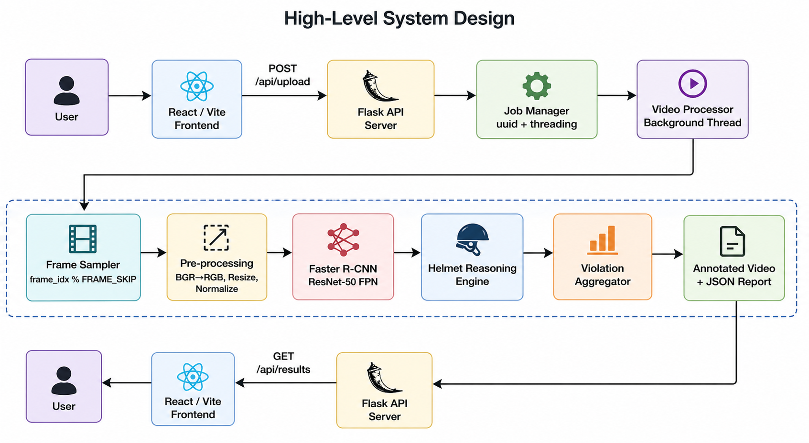
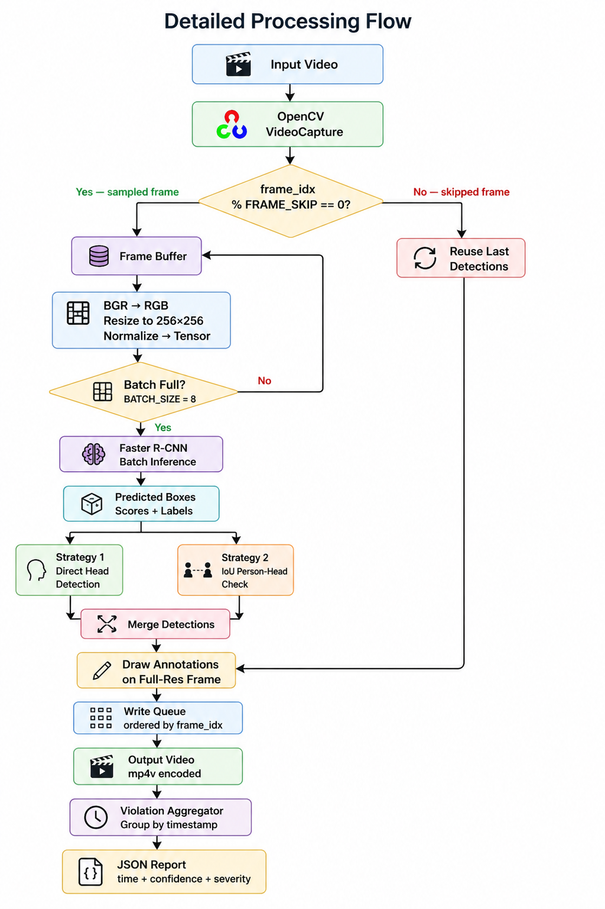
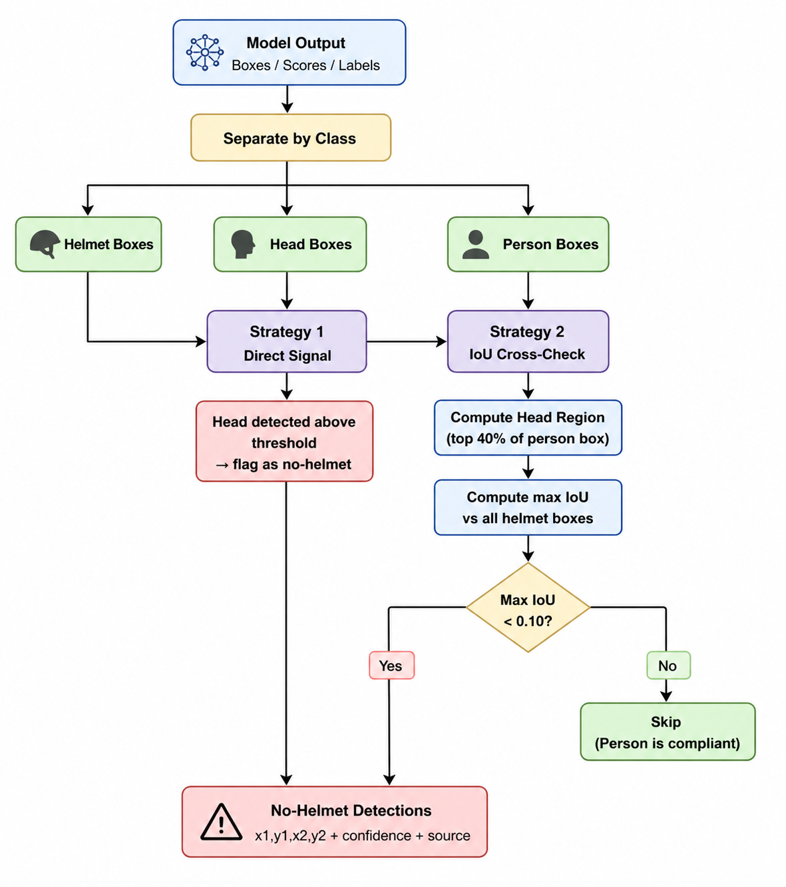

# 🪖 Safesight 
A project under the course UCS532: Computer vision (3W13)

*An end-to-end computer vision system for detecting helmet compliance in video — without YOLO.*

## Table of Contents

- [Overview](#overview)
- [Motivation](#motivation)
- [Problem Statement](#problem-statement)
- [Key Idea](#key-idea)
- [System Architecture](#system-architecture)
- [Pipeline Walkthrough](#pipeline-walkthrough)
- [Core Logic: Helmet Reasoning Engine](#core-logic-helmet-reasoning-engine)
- [Mathematics](#mathematics)
- [Training Architecture](#training-architecture)
- [API Reference](#api-reference)
- [Project Structure](#project-structure)
- [Setup & Installation](#setup--installation)
- [Evaluation](#evaluation)
- [Strengths & Limitations](#strengths--limitations)
- [Future Work](#future-work)

## Overview

SafeSight is a *multi-stage computer vision pipeline* that processes uploaded videos to detect helmet-compliance violations. It is built without YOLO — instead using *Faster R-CNN* (ResNet-50 FPN backbone) combined with a custom rule-based spatial reasoning engine that infers whether a person is wearing a helmet.

The system is not just a model. It includes:

- A trained *Faster R-CNN* detector for helmet, head, and person
- A *Helmet Reasoning Engine* using IoU-based spatial logic
- A *Flask REST API* with background job processing
- A *React / Vite* frontend for upload, progress tracking, and results
- Optional *image enhancement* pre-processing for low-quality footage

## Motivation
Industrial environments like warehouses and factories are high-risk zones where strict safety compliance—such as wearing helmets—is essential. However, manual monitoring is often inconsistent, error-prone, and not scalable across large facilities. As a result, safety violations frequently go unnoticed until accidents occur.

SafeSight automates safety monitoring using computer vision to detect helmet compliance in real time. It enables continuous surveillance through existing camera systems, reduces reliance on manual supervision, and improves overall workplace safety efficiently.

## Problem Statement

In safety-critical environments — construction sites, factories, roads — monitoring helmet compliance from CCTV or recorded video manually is:

- *Slow* — hours of footage per inspector
- *Error-prone* — fatigue causes missed violations
- *Not scalable* — grows linearly with camera count

The detection problem itself is hard:

- The same person appears across hundreds of frames
- Helmets can be partially occluded
- Lighting conditions vary drastically
- Heads are often small relative to the full frame
- Raw detections must be converted into meaningful, timestamped violation events

*Goal:* Build an automated system that detects violations, annotates the video, and returns a structured report through an API — fast enough for practical use and explainable enough to debug.

## Key Idea

> Instead of detecting helmets with YOLO, use *Faster R-CNN + Spatial Reasoning*.

The model is trained to detect three objects:

| Class | Meaning |
|---|---|
| helmet | A helmet visible in the frame |
| head | A bare head (no helmet visible) |
| person | A person's full body |

The *Helmet Reasoning Engine* then interprets these detections using two complementary rules, combining them to produce a final violation decision per person per frame.

## System Architecture

### High-Level System Design

### Detailed Processing Flow

### Backend Job Lifecycle

## Pipeline Walkthrough

### Step 1 — Upload & Job Creation

The user uploads a video through the frontend. The Flask backend:

1. Saves the file to uploads/
2. Generates a short job_id (UUID prefix)
3. Initialises an in-memory job record
4. Spawns a *background daemon thread* to process the video
5. Returns job_id immediately so the frontend can poll status

### Step 2 — Frame Sampling

Reading every frame from a long video is expensive. The system uses *frame skipping*:

- Only frames where frame_idx % FRAME_SKIP == 0 are sent to the model
- Skipped frames reuse the previous frame's bounding boxes
- This gives 5× reduction in inference calls with minimal visual impact

### Step 3 — Batch Inference

Sampled frames are buffered until BATCH_SIZE = 8 accumulate, then sent to Faster R-CNN in a single GPU batch. This is significantly faster than one-by-one inference.

### Step 4 — Helmet Reasoning Engine

The raw detections are passed to the *Helmet Reasoning Engine* (see next section).

### Step 5 — Annotation & Video Reconstruction

Each frame is annotated with:

- *Gray* boxes for detected persons
- *Green* boxes for detected helmets
- *Red* boxes with NO HELMET XX% for violations
- A *red alert banner* across the top if any violation is found in that frame

The frames are written in order to an mp4v output file.

### Step 6 — Violation Aggregation

Individual frame violations are grouped by timestamp. Consecutive seconds are merged into ranges (e.g., 00:12 - 00:15), giving a clean, human-readable violation report.

## Core Logic: Helmet Reasoning Engine

The heart of the project is no_helmet_detection.py. It converts raw bounding boxes into safety decisions using two complementary strategies

### Strategy 1 — Direct Head Detection

The model was trained with a head class that specifically represents a bare (unprotected) head. Any head prediction above the confidence threshold is directly flagged as a violation.

- *Advantage:* Fast, no extra computation
- *Limitation:* Depends on model being confident about distinguishing head from helmet

### Strategy 2 — IoU-Based Person-Helmet Cross-Check

For each person box:

1. Extract the *head region* — top 40% of the person bounding box
2. Compute *IoU* between this head region and every detected helmet box
3. Take the *maximum overlap* found
4. If max_overlap < 0.10 → no helmet is covering that person's head

*Why this matters:* A compliant person should have a helmet box that strongly overlaps the top of their body box. If the overlap is absent or negligible, the head is unprotected.

The no-helmet confidence score is directly derived from this:

no_helmet_confidence = 1.0 - max_overlap_iou

If IoU = 0.0 (no helmet anywhere near), confidence = 1.0 (certain violation).
If IoU = 0.9 (helmet fully covers head region), confidence = 0.1 (likely compliant).

## Documentation and Articles

| Article | Link |
| :--- | :--- |
| The introduction | https://ayushgarg282800.substack.com/p/what-makes-a-computer-vision-project |
| The research methodology | https://shubhampathneja21.substack.com/p/the-closed-loop-workflow-a-better |
